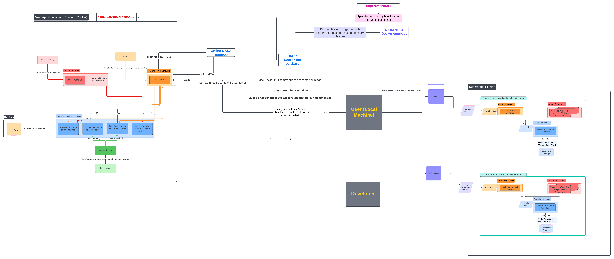
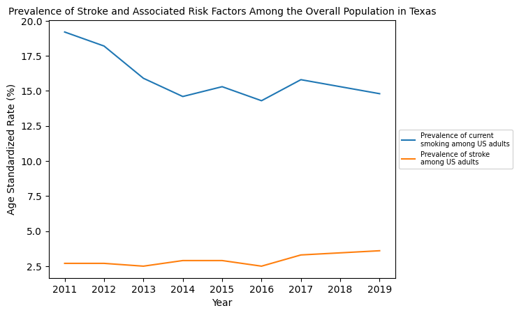
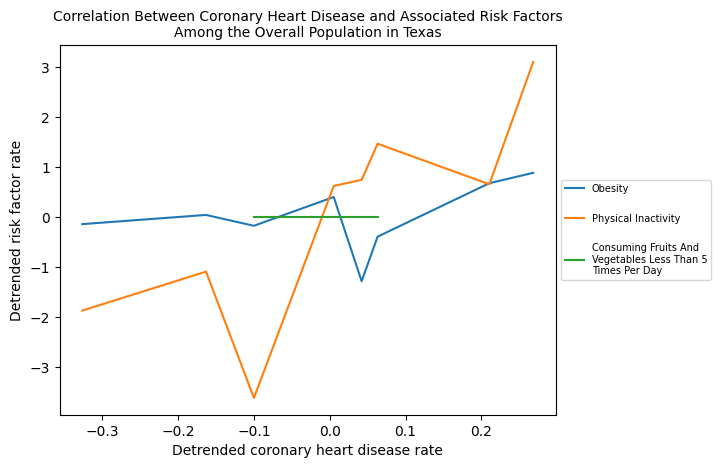

<h1 align="center"> Cardiovascular Disease Across the United States</h1>
<p align="center">
  <b>A containerized Flask-Redis-Kubernetes application that analyzes behavioral risk factors on cardiovascular disease across the US states. Final Project for COE332 (Software Engineering and Design).</b></br>
  <sub><sub>
</p>

<br />

[](#purpose)
#  Purpose
The project aims to illuminate various correlations between behavioral patterns and cardiovascular diseases. The app includes:
1. several endpoints for retrieving specific data subsets, such as by class (cardiovascular rates or risk factors), topic (specific cardiovascular diseases or risk factors), location (states), and breakout category (gender, age, or race)
2. functionality to post, delete, and retrieve data from a Redis database
3. various data analysis (calculating most affected populations to specific diseases). 
4. visualizations in graphs (of correlations between behavioral patterns like smoking and different cardiovascular diseases like stroke).
The app's easy functionality for data visualization should allow for widespread access to data patterns and future insights into how lifestyle choices and demographic factors can contribute to cardiovascular health.
Ultimately, the app can help inform public health strategies and interventions.

[](#data)
#  Data
Data about various behavioral risk factors (leading to cardiovascular disease) is sourced from the CDC: [National Cardiovascular Disease Surveillance Data)](https://data.cdc.gov/Heart-Disease-Stroke-Prevention/Behavioral-Risk-Factor-Surveillance-System-BRFSS-N/ikwk-8git/about_data). The risk surveillance system is provided by the National Cardiovascular Disease Surveillance System, which integrated multiple indicators from different data sources to create a comprehensive list of Cardiovascular Diseases (CVD) and associated risk factors across the United States (with around 10 years worth of tracking). Data parameters include year (2011 to 2022), location (national, regional, state, selected sites), indicators (obesity, smoking, etc.), type of CVD (i.e. stroke or heart failure), age group, sex, and race. There are approximately 160,160 data points. Data was last updated August 25th, 2023. Data can be accessed in either a csv or json format; for this project, the app uses the csv data format.

[](#foldercontents)
#  Folder Contents/Program Structure:
The following files are included for correct deployment of this app:
1. "api.py": code that includes flask routes that users can curl/access.
2. "jobs.py": initializes jobs based on user inputs and adds jobs (along with the necessary parameters) to a job queue.
3. "worker.py": takes jobs off of the job queue, computes the value, and returns the value.
4. "test_api.py": code to test api.py.
5. "test_jobs.py": code to test jobs.py.
6. "test_worker.py": code to test worker.py.'
7. "requirements.txt": the required versions of python libraries (for optimal performance).
8. "Dockerfile": contains instructions for docker to work (building/running program with the requirements, api, jobs, and worker files).
9. "docker-compose.yml":  containerized docker commands (for automation purposes).
10. "data/": an empty data folder (includes a .gitcanary file to post the relatively empty data/ folder to GitHub). Redis database writes a dump.rdb file to this folder. Empty data/ folder is created for correct write permissions. 
11. "diagram.png": software diagram of this application.
12. "README.md": this file, describes the functionality of the cardiovascular disease app.

The program has 16 files to set up kubernetes: 8 files to set up the production environment and 8 files to test the environment. The 8 files in the production are:
1. "app-prod-deployment-flask.yaml": Deployment configuration for the Flask application in the production environment. Manages the deployment of pods running the Flask app.
2. "app-prod-deployment-redis.yaml": Deployment configuration for the Redis service in the production environment. Manages the deployment of pods running Redis.
3. "app-prod-deployment-worker.yaml": Deployment configuration for the worker component in the production environment. Manages the deployment of pods running the worker.
4. "app-prod-ingress-flask.yaml": Ingress configuration for routing external traffic to the Flask application in the production environment. Manages the routing of HTTP and HTTPS traffic.
5. "app-prod-pvc-redis.yaml": PersistentVolumeClaim (PVC) configuration for the Redis service in the production environment. Manages the storage resources for Redis.
6. "app-prod-service-flask.yaml": Service configuration for the Flask application in the production environment. Provides a stable endpoint for accessing the Flask app.
7. "app-prod-service-nodeport-flask.yaml": NodePort Service configuration for the Flask application in the production environment. Exposes the Flask app on a specific port on all nodes in the cluster.
8. "app-prod-service-redis.yaml": Service configuration for the Redis service in the production environment. Provides a stable endpoint for accessing Redis.
8 more files are nearly identical to the production files listed above; each of them began with “app-test” instead of “app-prod” and set up a test environment instead of the production environment. 

[](#diagram)
# Diagram
A software diagram is presented below. 



This image shows the various files and how the interact with the user (via flask commands) and with each other.


[](#implementation)
#  Implementation

## To Build Image
1. Clone this repository:
```bash
git clone git@github.com:rx9933/COE-332-Homework.git
```
2. Navigate to this directory (homework08). 
3. To run program:
```bash
docker-compose up -d
```
Leave the program running while proceeding with Making Requests to Container. Only use "To stop program" when done interacting with app.

4. To stop program:
```bash
docker-compose down
```

## To Launch Kubernetes
The following instructions are to launch the a production environment, not the test environment.
Follow these steps after "To Build Image". Execute the following commands after navigating to the kubernetes/prod directory. 

1.  Create a persistent volume claim (PVC) for redis, a redis deployment that binds to the PVC, and a redis service.
  Use the following command: 
  ```bash
   kubectl apply -f app-prod-redis-pvc.yml && kubectl apply -f app-prod-redis-deployment.yml && kubectl apply -f app-prod-redis-service.yml
  ```
  This should output:
  ```bash
   ubuntu@a2097855-coe332-vm:~/FinalProject/Cardio-Disease/kubernetes/prod$ kubectl apply -f app-prod-redis-pvc.yml && kubectl apply -f app-prod-redis-deployment.yml && kubectl apply -f app-prod-redis-service.yml
   persistentvolumeclaim/app-prod-redis created
   deployment.apps/app-prod-redis-deployment created
   service/app-prod-redis-service created
  ```
   
   To ensure the Redis deployment is correctly running and the PVC is properly bound.
   Use the following command:
   ```bash
      kubectl get deployment && kubectl get pvc && kubectl get services
   ```
   This should output:
   ```bash
      ubuntu@a2097855-coe332-vm:~/FinalProject/Cardio-Disease/kubernetes/prod$ kubectl get deployment && kubectl get pvc && kubectl get services
      NAME                         READY   UP-TO-DATE   AVAILABLE   AGE
      app-prod-redis-deployment    1/1     1            1           5m6s
      cardio-prod-api-deployment   0/1     1            0           3d20h
      py-debug                     1/1     1            1           24h
      NAME             STATUS   VOLUME                                     CAPACITY   ACCESS MODES   STORAGECLASS   AGE
      app-prod-redis   Bound    pvc-ba9e8150-8c9e-44d2-9d97-e1cadaa30427   1Gi        RWO            cinder-csi     5m6s
      NAME                     TYPE        CLUSTER-IP     EXTERNAL-IP   PORT(S)    AGE
      app-prod-redis-service   ClusterIP   10.233.6.102   <none>        6379/TCP   5m5s
   ```

2. Replace the Redis service cluster IP with the appropriate IP address in the flask-deployment and wrk-deployment yaml files.
   To find the Redis service IP address, use the following command:
  ```bash
      kubectl get services
  ```

  This should output:
   ```bash
      ubuntu@a2097855-coe332-vm:~/FinalProject/Cardio-Disease/kubernetes/prod$ kubectl get services
      NAME                     TYPE        CLUSTER-IP      EXTERNAL-IP   PORT(S)    AGE
      app-prod-redis-service   ClusterIP   10.233.49.119   <none>        6379/TCP   24s
  ```

  In this case, the IP address is 10.233.49.119.
  To get the current values written in the flask and worker deployments, use:
  ```bash
   grep -r 10 
  ```
  This should output:
  ```bash
     ubuntu@a2097855-coe332-vm:~/FinalProject/Cardio-Disease/kubernetes/prod$ grep -r 10 
     app-prod-flask-deployment.yml:                    value: '10.233.6.102'
     app-prod-wrk-deployment.yml:              value: '10.233.6.102'
  ```

  To replace all instances of 10.233.6.102 with 10.233.49.119, navigate out of the prod folder with
  ```bash
  cd ../
  ```
  
  then use the following command:
  ```bash
     sed -i 's/10.233.6.102/10.233.49.119/g' prod/*.yml
  ```
    
  Make sure to replace 10.233.6.102 with the correct current value and 10.233.49.119 with the correct redis service IP.
  
3. Finally, navigate back into the prod/ folder then apply the remaining kubernetes files to launch the flask, worker, nodeport, and ingress services. 
  ```bash
   cd prod/
   kubectl apply -f app-prod-flask-deployment.yml
   kubectl apply -f app-prod-flask-service.yml
   kubectl apply -f app-prod-wrk-deployment.yml
   kubectl apply -f app-prod-nodeport-service.yml
   kubectl apply -f app-prod-ingress.yml
  ```
  This should output:
  ```bash
   ubuntu@a2097855-coe332-vm:~/FinalProject/Cardio-Disease/kubernetes/prod$ kubectl apply -f app-prod-flask-deployment.yml
   kubectl apply -f app-prod-flask-service.yml
   kubectl apply -f app-prod-wrk-deployment.yml
   kubectl apply -f app-prod-nodeport-service.yml
   kubectl apply -f app-prod-ingress.yml
   deployment.apps/app-prod-flask-deployment created
   service/app-prod-flask-service created
   deployment.apps/app-prod-wrk-deployment created
   service/nodeport-service created
   ingress.networking.k8s.io/app-ingress created
  ```

[](#routes)
# Routes
Note: Proceed only if "To Build Image" is complete and the app is running (step 3). 
The following are various curl commands/routes that can be utilized: 
0. Help Function
  * To get information about different jobs or functions supported by the application:
    ```bash
    curl localhost:5000/
    ```
    This will return a large string with different routes and their purposes.
    
1. Redis Functionality
    * To add data to Redis:
    ```bash
      curl localhost:5000/data -X POST
    ```
    This will return:
    ```bash
      Data posted successfully
    ```
    
    * To retrieve data from Redis:
    ```bash
      curl localhost:5000/data -X GET
    ```
    This should return a long list of dictionaries of cardiovascular data.
    
    * To delete data from Redis:
    ```bash
      curl localhost:5000/data -X DELETE
    ```
    This should return:
    ```bash
      Data deleted successfully
    ```
    * To return data within a certain time range:
    ```bash
      curl "localhost:5000/year_data?start=2017&end=2020"
    ```
    Note that start and end parameters are optional (users can provide either start or end or neither/both of the parameters). Start represents the start of the data being returned (in this case, data after and during 2017 is returned) while end represents the end of the data being returned (in this case, data during 2020 and before is returned). If no parameters are input, the entire dataset will be returned, like in "To retrieve data from Redis".
   
   Also, note the quotation marks in this command: if both parameters are input, quotes are required. If only one parameter or no parameters are input, then no quotes are necessary.
   
   This command will return a long list set of dictionaries, where each dictionary represents a data point.
   
   If invalid start/end parameters are input, then for whichever invalid input, the default value will be set: start will be assigned to year 0 and/or end will be assigned to year 5000 (thus the entire data set might be returned).
   
   Valid inputs that lead to no data (i.e., start=2024 and end = 2020 or start = 8 and end = 10) will result in the following being output to screen:
   ```bash
   {}
   ```
   This result might show up if data has not been posted to (or has been deleted from) redis as well. View below note.
   
   * To return explore the different parameters of a given category:
    ```bash
      curl localhost:5000/data/<category>
    ```
    The different categories that can be used are: (['row_id', 'year', 'locationabbr', 'locationdesc', 'datasource', 'priorityarea1', 'priorityarea3', 'category', 'topic', 'indicator', 'data_value_type', 'data_value_unit', 'data_value_alt', 'data_value_footnote_symbol', 'data_value_footnote', 'break_out_category', 'break_out', 'categoryid', 'topicid', 'indicatorid', 'data_value_typeid', 'breakoutcategoryid', 'breakoutid', 'locationid', 'geolocation']
    An example command is:
    ```bash
     curl cardio-app.coe332.tacc.cloud/data/break_out
    ```
    This would return:
    ```bash
    [
    "Other",
    "Non-Hispanic Asian",
    "Non-Hispanic White",
    "Hispanic",
    "Non-Hispanic Black",
    "Overall",
    "65+",
    "45-64",
    "Female",
    "35+",
    "25-44",
    "75+",
    "Male",
    "18-24",
    "20-24"
  ]
  ```
    These are the different break_out categories. 
   
    *Note*: Data on Redis is required for any data analysis; that is how the worker.py gets the data as input. As such, data deletion is not advised to be performed before adding/curling job requests. Doing so will result in empty/uninteresting results as output. 
   
3. Job Functionality
    * To add a job:
    ```bash
      curl localhost:5000/jobs/<functionName> -X POST -d '{"parameter key 1": "input data 1", "parameter key 2": "input data 2"}' -H "Content-Type: application/json"
    ```
   "functionName" should be replaced with a specific worker.py function name, based on the functionality desired for the particular job. View below (Job Functions          section) for more details and example jobs. The dictionary containing "parameter key 1" and "parameter key 2" is a dictionary of any size (based on the             required information for the specific worker.py function). The job's details (including a job-specific, unique ID) will be returned as a dictionary after the       job is posted.
   *Note*: ensure that the input dictionary is of strings; both the keys and values must be strings.

   * To remove all jobs that have not begun (leaves only complete or in-progress jobs):
   ```bash
     curl localhost:5000/jobs/delete -X DELETE
   ```
   
    * To list all existing jobs (IDs):
   ```bash
     curl localhost:5000/jobs -X GET
   ```
   Returns a list of all job IDs that have been submitted, are in-progress, or are completed. 
  
    * To return information about a specific job (status):
   ```bash
     curl localhost:5000/jobs/<"specific_job_id"> -X GET
   ```
   "specific_job_id" should be replaced with the desired job ID. View "To add a job" and "To list all existing jobs" for information on retrieving specific job IDs.

   * To return information about a specific job (the output/results):
   ```bash
     curl localhost:5000/results/<"specific_job_id"> -X GET
   ```
   "specific_job_id" should be replaced with the desired job ID. View "To add a job" and "To list all existing jobs" for information on retrieving specific job IDs. 
     *Note*: interesting results will only be output when the job is complete; check for completion status with the previous command. 
   
[](#jobfunctions)
# Job Functions
There are currently 5 job functions that can be run. Note that these are in addition to the flask routes detailed in Redis Functionality (1). Each of the commands listed in Job Functionality can be applied to each of the 5 main jobs (return_topics, max_affected, graph_rf, graph_correlation, and correlation). *Note*: for the example routes shown below, the job id should be replaced with the job id that the user's receive to screen. 
As an example, a test job is shown below: 
1. test_work: this function is just a work simulation. No real analysis is performed; the worker just sleeps for 20 seconds before returning a random output.
      * To instantiate a job for return_topics:
   ```bash
      curl localhost:5000/jobs/test_work -X POST -d '{}' -H "Content-Type: application/json"
   ```
   Note that any input parameters can be input, but they will be ignored since this function does not require any input from users.
   this will return:
   ```bash
      {
     "function_name": "test_work",
     "id": "88e0881c-93c8-49ef-b035-c70b594a6ec3",
     "input_parameters": {},
     "status": "submitted"
   }
   ```
   * To check the status of the job:
   ```bash
      curl localhost:5000/jobs/88e0881c-93c8-49ef-b035-c70b594a6ec3
   ```
      this will return:
   ```bash
   {
     "function_name": "test_work",
     "id": "88e0881c-93c8-49ef-b035-c70b594a6ec3",
     "input_parameters": {},
     "status": "in progress"
   }
   ```
   or the status will be completed/submitted.
   
   * To get the results of the job:
    ```bash
       curl localhost:5000/results/88e0881c-93c8-49ef-b035-c70b594a6ec3
    ```
    this will return:
   ```bash   
        {
     "random output parameter 1": "1st output parameter value"
   }
   ```
   or if the job is not complete:
   ```bash
      Result not found for the specified Job ID. Check completion status of job.
   ```
   
2. return_topics: this function returns the cardiovascular topics that are investigated (Acute Myocardial Infarction, Stroke, etc.).
   * To instantiate a job for return_topics:
   ```bash
      curl localhost:5000/jobs/return_topics -X POST -d '{}' -H "Content-Type: application/json"
   ```
   Note that any input parameters can be input, but they will be ignored since this function does not require any input from users.
   this will return:
   ```bash
      {
     "function_name": "return_topics",
     "id": "80df529b-6f2c-4ec8-adf8-2990e85a37af",
     "input_parameters": {},
     "status": "submitted"
   }
   ```
   * To check the status of the job:
   ```bash
      curl localhost:5000/jobs/80df529b-6f2c-4ec8-adf8-2990e85a37af
   ```
      this will return:
   ```bash
      {
        "function_name": "return_topics",
        "id": "80df529b-6f2c-4ec8-adf8-2990e85a37af",
        "input_parameters": {},
        "status": "in progress"
      }
   ```
   or the status will be completed/submitted.
   
   * To get the results of the job:
    ```bash
       curl localhost:5000/results/80df529b-6f2c-4ec8-adf8-2990e85a37af
    ```
    this will return:
   ```bash   
      [
     "Acute Myocardial Infarction (Heart Attack)",
     "Stroke",
     "Coronary Heart Disease",
     "Major Cardiovascular Disease"
   ]
   ```
   or if the job is not complete:
   ```bash
      Result not found for the specified Job ID. Check completion status of job.
   ```
3. max_affected: returns the population with the maximum rates of a particular cardiovascular disease. Based on input parameters, the user can restrict the app to check for a particular cardiovascular disease (i.e., stroke) and/or a particular break out category (either in gender, race, or age) and/or a particular year (i.e. 2013).
   * To instantiate a job for max_affected:
   ```bash
      curl localhost:5000/jobs/max_affected -X POST -d '{"year":"2014","topic":"Coronary Heart Disease","break_out":"65+"}' -H "Content-Type: application/json"
   ```
   Note that any input parameters can be used, even with different/wrong keys. If the correct keys are input with inaccurate/nonvalid values (i.e, year = -1990), then no values will be output (the app cannot find values that suite the input parameters). If the wrong keys are input, (i.e., lyear = 2014), then this input parameter will be ignored as well.
   this will return:
   ```bash
      {
     "function_name": "max_affected",
     "id": "dae2b9cf-f04a-4a67-a564-fa3530fc1d89",
     "input_parameters": {
       "break_out": "65+",
       "topic": "Coronary Heart Disease",
       "year": "2014"
     },
     "status": "submitted"
      }
   ```
   * To check the status of the job:
   ```bash
      curl localhost:5000/jobs/dae2b9cf-f04a-4a67-a564-fa3530fc1d89
   ```
      this will return:
   ```bash
         {
     "function_name": "max_affected",
     "id": "dae2b9cf-f04a-4a67-a564-fa3530fc1d89",
     "input_parameters": {
       "break_out": "65+",
       "topic": "Coronary Heart Disease",
       "year": "2014"
     },
     "status": "in progress"
      }
   ```
   or the status might be completed/submitted.
   
   * To get the results of the job:
    ```bash
       curl localhost:5000/results/dae2b9cf-f04a-4a67-a564-fa3530fc1d89
    ```
    this will return:
   ```bash
      {
     "break_out": "65+",
     "break_out_category": "Age",
     "breakoutcategoryid": "BOC03",
     "breakoutid": "AGE06",
     "category": "Cardiovascular Diseases",
     "categoryid": "C1",
     "data_value": "16.8",
     "data_value_alt": "16.8",
     "data_value_type": "Crude",
     "data_value_typeid": "Crude",
     "data_value_unit": "Percent (%)",
     "datasource": "BRFSS",
     "geolocation": {
       "coordinates": [
         -92.44568007099969,
         31.31266064400046
       ],
       "type": "Point"
     },
     "highconfidencelimit": "18.9",
     "indicator": "Prevalence of coronary heart disease among US adults (18+); BRFSS",
     "indicatorid": "BR002",
     "locationabbr": "LA",
     "locationdesc": "Louisiana",
     "locationid": "22",
     "lowconfidencelimit": "14.9",
     "priorityarea1": "None",
     "priorityarea3": "None",
     "row_id": "BRFSS~2014~22~BR002~AGE06~Crude",
     "topic": "Coronary Heart Disease",
     "topicid": "T4",
     "year": "2014"
   }
   ```
   or, if job status is "in progress" or "submitted":
   ```bash
      Result not found for the specified Job ID. Check completion status of job.
   ```

4. graph_rf: graphs the time series of a given disease alongside the time series of several associated risk factors (as specified by the users).
  
   * To instantiate a job for max_affected:
    ```bash
    curl localhost:5000/jobs/graph_rf -X POST -d '{"disease":"stroke", "risk_factors":["current smoking"], "location":"Texas", "breakout_params":"65+"}' -H "Content-Type: application/json"
    ```
     Note that the disease and risk_factors are required parameters to be input. location and breakout_params are optional values. Also note that multiple risk factors can be analyzed at a single time; simply add to the list of risk_factors: "risk_factors":["Smoking", "Physical Inactivity"].   
 
      This returns:
    ```bash
          {
      "function_name": "graph_rf",
      "id": "0f0f6371-c837-4e65-a918-e0b3b74b1bd4",
      "input_parameters": {
        "disease": "stroke",
        "location": "Texas",
        "risk_factors": [
          "current smoking"
        ]
      },
      "status": "submitted"
    }
    ```

    * To check the status of the job:
     ```bash
        curl localhost:5000/jobs/0f0f6371-c837-4e65-a918-e0b3b74b1bd4
     ```
      this will return:
     ```bash
             {
          "function_name": "graph_rf",
          "id": "0f0f6371-c837-4e65-a918-e0b3b74b1bd4",
          "input_parameters": {
            "disease": "stroke",
            "location": "Texas",
            "risk_factors": [
              "current smoking"
            ]
          },
          "status": "in progress"
        }
     ```
   or the status might be completed/submitted.

   * To check the results of the job:
   ```bash
      curl localhost:5000/results/0f0f6371-c837-4e65-a918-e0b3b74b1bd4
   ```
     
      this will return:
     ```bash
          Result not found for the specified Job ID. Check completion status of job.
     ```
       or
      ```bash
          "Image is available for download with the route /download/0f0f6371-c837-4e65-a918-e0b3b74b1bd4"
     ```
   * To download the image, use:
     ```bash
      curl localhost:5000/download/0f0f6371-c837-4e65-a918-e0b3b74b1bd4 --output out.png
     ```
       This will download a png image of the graph to your terminal. For easy viewing, performing these steps (submitting and downloading the job) via the Kubernetes platform (detailed below), so that the image can be loaded directly on your computer.
     
       An example of this image is shown below:

       
     

  5.  correlation: calculates the coefficient coefficient between the user-specified disease and various risk factors. 
  * To instantiate a job for max_affected:
      ```bash
      curl localhost:5000/jobs/correlation -X "POST" -d '{"breakout":"Overall", "risk_factors": ["Obesity", "Physical Inactivity", "consuming fruits and vegetables less than 5 times per day"], "disease": "Coronary Heart Disease", "location": "Texas"}' -H "Content-Type: application/json"
      ```
     Note that the disease and risk_factors are required parameters to be input. location and breakout_params are optional values. Also note that multiple risk factors can be analyzed at a single time; simply add to the list of risk_factors: "risk_factors":["Smoking", "Physical Inactivity"].   
 
      This returns:
      ```bash
                 {
        "function_name": "correlation",
        "id": "c5f83a04-e2fc-455a-94ca-3258a106f553",
        "input_parameters": {
          "breakout": "Overall",
          "disease": "Coronary Heart Disease",
          "location": "Texas",
          "risk_factors": [
            "Obesity",
            "Physical Inactivity",
            "consuming fruits and vegetables less than 5 times per day"
          ]
        },
        "status": "submitted"
      }
      ```

    * To check the status of the job:
       ```bash
          curl localhost:5000/jobs/c5f83a04-e2fc-455a-94ca-3258a106f553
       ```
      this will return:
       ```bash
                   {
          "function_name": "correlation",
          "id": "c5f83a04-e2fc-455a-94ca-3258a106f553",
          "input_parameters": {
            "breakout": "Overall",
            "disease": "Coronary Heart Disease",
            "location": "Texas",
            "risk_factors": [
              "Obesity",
              "Physical Inactivity",
              "consuming fruits and vegetables less than 5 times per day"
            ]
          },
          "status": "in progress"
        }
       ```
   or the status might be completed/submitted.

   * To check the results of the job:
     ```bash
        curl localhost:5000/results/c5f83a04-e2fc-455a-94ca-3258a106f553
     ```
     
      this will return:
       ```bash
            Result not found for the specified Job ID. Check completion status of job.
       ```
       or
        ```bash
          {
            "Correlation coefficient between consuming fruits and vegetables less than 5 times per day and coronary heart disease": "Not enough data",
            "Correlation coefficient between obesity and coronary heart disease": 0.38723599856793467,
            "Correlation coefficient between physical inactivity and coronary heart disease": 0.7849728887395832
          }
       ```
   6. graph_correlation: plots the correlation coefficient across time for different risk factors and the associated disease. 
       * To instantiate a job for graph_correlation:
      ```bash
        curl localhost:5000/jobs/graph_correlation -X "POST" -d '{"breakout":"Overall", "risk_factors": ["Obesity", "Physical Inactivity", "consuming fruits and vegetables less than 5 times per day"], "disease": "Coronary Heart Disease", "location": "Texas"}' -H "Content-Type: application/json
      ```
     Note that the disease and risk_factors are required parameters to be input. location and breakout_params are optional values. Also note that multiple risk factors can be analyzed at a single time; simply add to the list of risk_factors: "risk_factors":["Smoking", "Physical Inactivity"].   
 
      This returns:
        ```bash
                   {
        "function_name": "graph_correlation",
        "id": "5cfc13d7-7ba4-4210-8f9c-4d3319294d83",
        "input_parameters": {
          "breakout": "Overall",
          "disease": "Coronary Heart Disease",
          "location": "Texas",
          "risk_factors": [
            "Obesity",
            "Physical Inactivity",
            "consuming fruits and vegetables less than 5 times per day"
          ]
        },   
        "
         "status": "submitted"
        }
      ```

    * To check the status of the job:
       ```bash
          curl localhost:5000/jobs/c5f83a04-e2fc-455a-94ca-3258a106f553
       ```
      this will return:
       ```bash
                   {
          "function_name": "graph_correlation",
          "id": "5cfc13d7-7ba4-4210-8f9c-4d3319294d83",
          "input_parameters": {
            "breakout": "Overall",
            "disease": "Coronary Heart Disease",
            "location": "Texas",
            "risk_factors": [
              "Obesity",
              "Physical Inactivity",
              "consuming fruits and vegetables less than 5 times per day"
            ]
          },
          "status": "in progress"
        }
       ```
   or the status might be completed/submitted.

   * To check the results of the job:
     ```bash
        curl localhost:5000/results/5cfc13d7-7ba4-4210-8f9c-4d3319294d83
     ```
     
      this will return:
       ```bash
            Result not found for the specified Job ID. Check completion status of job.
       ```
       or
     
        ```bash
            "Image is available for download with the route /download/0f0f6371-c837-4e65-a918-e0b3b74b1bd4"
       ```
   * To download the image, use:
       ```bash
        curl localhost:5000/download/5cfc13d7-7ba4-4210-8f9c-4d3319294d83 --output out.png
       ```
       This will download a png image of the graph to your terminal. For easy viewing, performing these steps (submitting and downloading the job) via the Kubernetes platform (detailed below), so that the image can be loaded directly on your computer.

       An example of this image is shown below:

       
     
# Using Kubernetes
If Kubernetes is launched correctly, all commands as described in Routes and Jobs can be written from the a local terminal (which does not have docker or kubernetes installed). Additionally, all get requests can be launched from the internet. Post or delete requests can also be launched from the internet if an API like Postman is used.
Note that any commands written through localhost are not recorded on the kubernetes cluster; all commands written from the local terminal or on the internet will be recorded on the kubernetes cluster. 

An ingress opens the kubernetes node for access, and an ingress allows for access from a local terminal/internet. 
The name of the ingress can be found by using:
```bash
  ubuntu@a2097855-coe332-vm:~/FinalProject/Cardio-Disease/kubernetes/prod$ kubectl get ingress
  NAME          CLASS   HOSTS                          ADDRESS                                                    PORTS   AGE
  app-ingress   nginx   cardio-app.coe332.tacc.cloud   129.114.36.240,129.114.36.49,129.114.36.83,129.114.38.92   80
```
By replacing "localhost:5000" with the ingress host name, cardio-app.coe332.tacc.cloud, all the routes and jobs (as described above) can be accessed from a local terminal.
For example, to return a list of all the jobs, use:
```bash
curl cardio-app.coe332.tacc.cloud/jobs
```
On the internet, simply use the ingress host name (followed by, optionally, the specific route). To return a list all jobs, use:
```bash
cardio-app.coe332.tacc.cloud/jobs
```

[](#unittesting)
# Unit Testing
1. Follow "To Build Image", then, to identify the image being used, run the following command:
```bash
docker ps -a
```
This will return the docker containers that are currently running. The command should result in an output similar to :
```bash
CONTAINER ID   IMAGE                       COMMAND                  CREATED          STATUS          PORTS                                       NAMES
b28c1290cef1   rx9933/cardio-disease:2.0   "python3 worker.py"      20 seconds ago   Up 18 seconds                                               homework08_worker_1
d3d4d32bb5bc   rx9933/cardio-disease:2.0   "python3 api.py"         20 seconds ago   Up 19 seconds   0.0.0.0:5000->5000/tcp, :::5000->5000/tcp   homework08_flask-api_1
dd90c9d27722   redis:7                     "docker-entrypoint.s…"   20 seconds ago   Up 19 seconds   0.0.0.0:6379->6379/tcp, :::6379->6379/tcp   homework08_redis-db_1
```
"rx9933/cardio-disease:2.0" is the name of the image that is being used. d3d4d32bb5bc is the container ID for the api (note this value). 

2. Run the pytest command via:
```bash
docker exec -it d3d4d32bb5bc pytest
```
Replace d3d4d32bb5bc with the api container id as found in the previous step.
Due to the large number of tests being done, the test command may take around 7 minutes to complete.
Note: a different terminal (as long as it has Docker installed and has been navigated to the homework08 directory) can run the <pytest> command, as long as the docker image has been correctly pulled and is running (view "To Build Image").

[](#debugging)
# Debugging
## Launching Containers
* If the following error appears:
 ```bash
   curl: (7) Failed to connect to localhost port 5000 after 0 ms: Connection refused
 ```
 the docker containers where not properly launched. Repeat "To Build Image" and try route again.

 * If the following error appears when applying pytest:
   ```bash
      ====================================== short test summary info ======================================
   FAILED test_api.py::test_all_jobs - requests.exceptions.ConnectionError: HTTPConnectionPool(host='localhost', port=5000): Max retrie...
   FAILED test_api.py::test_submit_job - requests.exceptions.ConnectionError: HTTPConnectionPool(host='localhost', port=5000): Max retrie...
   FAILED test_api.py::test_invalid_function_name - requests.exceptions.ConnectionError: HTTPConnectionPool(host='localhost', port=5000): Max retrie...
   FAILED test_api.py::test_get_job - requests.exceptions.ConnectionError: HTTPConnectionPool(host='localhost', port=5000): Max retrie...
   FAILED test_api.py::test_get_result_by_id - requests.exceptions.ConnectionError: HTTPConnectionPool(host='localhost', port=5000): Max retrie...
   FAILED test_api.py::test_add_and_delete_job - requests.exceptions.ConnectionError: HTTPConnectionPool(host='localhost', port=5000): Max retrie...
   FAILED test_api.py::test_post_data - requests.exceptions.ConnectionError: HTTPConnectionPool(host='localhost', port=5000): Max retrie...
   FAILED test_api.py::test_get_data - requests.exceptions.ConnectionError: HTTPConnectionPool(host='localhost', port=5000): Max retrie...
   FAILED test_api.py::test_delete_data - requests.exceptions.ConnectionError: HTTPConnectionPool(host='localhost', port=5000): Max retrie..
   ```
   the docker containers where not properly launched. Repeat "To Build Image" and try route again.
   
## Understanding Results
* If max_affected or return_topics returns empty lists/dictionaries as output, then you probably have not posted the data to redis. Make sure to post the data to redis (do not delete it) and then try the job again.
* If the job is not completed, and you try to get the results with "curl localhost:5000/results/<"specific_job_id"> -X GET", then, the following result will be output:
```bash
Result not found for the specified Job ID. Check completion status of job.
```
Try to check the status of the job with "curl localhost:5000/jobs/<"specific_job_id"> -X GET" and make sure the status is "complete" before trying to check the results. 
* 


[](#contributions)
#  Contributions
* Arushi Sadam and Alana Gaughan on app development and writing the Readme.
* Professor Joe Allen: on providing help for all questions (regarding using environment variables, docker-compose, redis, etc.).
* [COE 332: Software and Engineering Design Read The Docs](https://coe-332-sp24.readthedocs.io/en/latest/unit05/containers_2.html): on usage (running the program with Linux commands)
* [CDC: National Cardiovascular Disease Surveillance Data)](https://data.cdc.gov/Heart-Disease-Stroke-Prevention/Behavioral-Risk-Factor-Surveillance-System-BRFSS-N/ikwk-8git/about_data): on providing data.
* ChatGPT: on writing this README.md.
